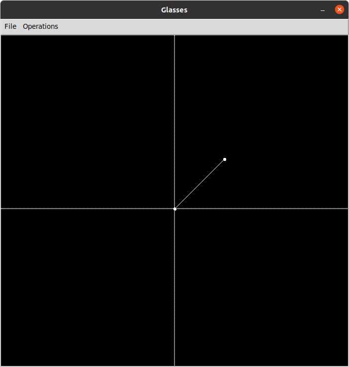

# glasses
A PaintBrush-like desktop application for building objects in
2D and 3D using Tkinter API. 

## How to use it?

There are 3 major components in 'glasses':
    
    * Canvas (right);
    * Text side panel (top left); and
    * Created objects side panel (bottom left).

Everytime component is desired to be presented,
the user must tell which are its coordinates.
With a single coordinate, a point will be shown;
with 2, a line, and, with even more, a polygon.

In order to add a component, one must use

> 'add (x1,y1) ... (xn, yn)'  # There must be NO space between x and y.
> 
> e.g. 'add (0,0)' or 'add (200,200) (-999,90)'

With the coordinates written, just press the 'Enter'
button at the interface and the given coordinates
will be properly painted over the 'canvas' and
listed at the 'created objects frame'.